<div align="center">

# 🎬 Cinerd — Metodologia, Algoritmos e Técnicas

**Como o sistema encontra um filme a partir de uma lembrança vaga e descobre o que você vai gostar de assistir.**


</div>

---

## 🗺️ Índice

- [Visão geral](#-visão-geral)
- [Parte 1 — SRI: encontrar um filme](#-parte-1--sri-encontrar-um-filme)
  - [Técnicas em resumo](#técnicas-em-resumo-sri)
  - [Busca fuzzy por nome](#-busca-fuzzy-por-nome)
  - [BM25 — recuperação lexical](#-bm25--recuperação-lexical)
  - [Embeddings semânticos multilíngues](#-embeddings-semânticos-multilíngues)
  - [Sinal temático (keywords)](#-sinal-temático-keywords)
  - [Sinal de personagem (fuzzy)](#sinal-de-personagem-fuzzy)
  - [Enredo via Wikipédia (léxico + MaxSim)](#enredo-via-wikipédia-léxico--maxsim)
  - [Fusão de sinais](#-fusão-de-sinais)
  - [Detecção de intenção](#-detecção-de-intenção)
  - [Entendimento de consulta via LLM (Groq)](#entendimento-de-consulta-via-llm-groq)
  - [Busca facetada](#-busca-facetada)
  - [Re-ranking com cross-encoder](#-re-ranking-com-cross-encoder)
  - [Reranking via LLM (lê e julga)](#reranking-via-llm-lê-e-julga)
  - [Reagrupamento por franquia](#reagrupamento-por-franquia)
  - [Busca multilíngue via TMDB](#-busca-multilíngue-via-tmdb)
  - [Explicabilidade](#-explicabilidade)
  - [Pipeline completo](#-pipeline-do-sri)
- [Parte 2 — Recomendação: traçar o perfil](#-parte-2--recomendação-traçar-o-perfil)
  - [Técnicas em resumo](#técnicas-em-resumo-recsys)
  - [Filtragem colaborativa (SVD)](#-filtragem-colaborativa-svd)
  - [Fold-in e fallbacks](#-fold-in-e-fallbacks)
  - [Relevance feedback (Rocchio)](#-relevance-feedback-rocchio)
  - [Perfil multi-interesse](#-perfil-multi-interesse)
  - [Reviews por filme](#-reviews-por-filme)
  - [De-viés de genericidade e MMR](#-de-viés-de-genericidade-e-mmr)
  - [Round-robin ponderado](#-round-robin-ponderado)
  - [Fusão híbrida (RRF)](#-fusão-híbrida-rrf)
  - [Filmes parecidos (item-to-item)](#-filmes-parecidos-item-to-item)
  - [Ingestão do Letterboxd](#-ingestão-do-letterboxd)
  - [Pipeline completo](#-pipeline-da-recomendação)
- [Glossário](#-glossário)
- [Mapa de arquivos](#-mapa-de-arquivos)

---

## 🔭 Visão geral

O Cinerd tem **dois motores independentes** que resolvem problemas diferentes:

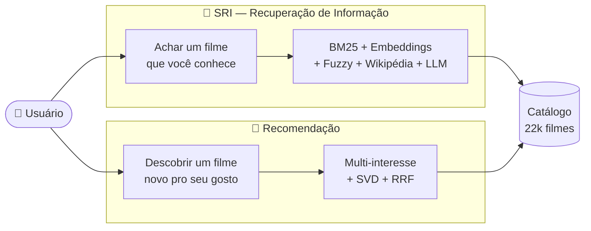

| | 🔎 **SRI** | 🍿 **Recomendação** |
|---|---|---|
| **Pergunta** | "Qual é aquele filme...?" | "O que eu vejo agora?" |
| **Entrada** | texto, diretor, ator, filtros | filmes/notas que você curte |
| **Usa ratings?** | ❌ Não | ✅ Sim |
| **Saída** | filmes que **casam** com a busca | filmes que você vai **gostar** |
| **Núcleo** | 8 sinais (BM25 + e5 + fuzzy + Wikipédia) + LLM (Groq) | k-means multi-interesse + SVD |

> [!NOTE]
> Os dois motores compartilham o mesmo **índice de embeddings** (`intfloat/multilingual-e5-large`, 1024 dimensões) sobre **22.029 filmes** — construído por [`retrieval/index_builder.py`](../retrieval/index_builder.py).

---

# 🔎 Parte 1 — SRI: encontrar um filme

> **Objetivo:** o usuário lembra *algo* (um trecho da história, um nome aproximado, o diretor) mas não o título exato. O sistema combina vários sinais de evidência para recuperar o filme certo entre 22 mil.

## Técnicas em resumo (SRI)

| Técnica | O que faz | O que resolve | Arquivo |
|---|---|---|---|
| **Busca fuzzy** | casa títulos tolerando erro de digitação e nome parcial | lembrança aproximada do nome | [`search_engine.py`](../retrieval/search_engine.py) |
| **BM25** | ranqueia filmes pelos termos da sinopse | achar pelo enredo, não pelo título | [`bm25.py`](../retrieval/bm25.py) |
| **Embeddings (e5)** | compara o *sentido* do texto, multilíngue | sinônimo, paráfrase, busca em inglês | [`index_builder.py`](../retrieval/index_builder.py) |
| **Sinal temático** | compara tema/atributo via *keywords* | conceitos que não estão na sinopse | [`search_engine.py`](../retrieval/search_engine.py) |
| **Sinal de personagem** | casa nome citado (fuzzy) contra o elenco de topo | erro de grafia em nome de personagem/ator | [`search_engine.py`](../retrieval/search_engine.py) |
| **Enredo via Wikipédia** | BM25 + embedding em trechos (MaxSim) sobre o texto completo | detalhe que não cabe na sinopse curta da TMDB | [`search_engine.py`](../retrieval/search_engine.py) · [`enrich.py`](../core/enrich.py) |
| **Fusão z-score + ReLU (com teto)** | combina os sinais numa escala comum, capando outlier | juntar evidências sem um termo raro dominar | [`search_engine.py`](../retrieval/search_engine.py) |
| **Detecção de intenção** | decide se a consulta é nome ou descrição | uma só caixa serve aos dois usos | [`search_engine.py`](../retrieval/search_engine.py) |
| **Entendimento via LLM (Groq)** | classifica objeto/pessoa/genérica e extrai pistas | ajusta peso de canal só pro tipo certo de consulta | [`query_llm.py`](../core/query_llm.py) |
| **Busca facetada** | restringe por diretor/ator/ano/gênero | afunilar com o que se sabe | [`search_engine.py`](../retrieval/search_engine.py) |
| **Cross-encoder** | re-pontua o topo lendo consulta+texto juntos (score) | precisão fina nas primeiras posições (*off* em produção) | [`reranker.py`](../retrieval/reranker.py) |
| **Reranking via LLM (Groq)** | lê a sinopse do candidato e confere o fato citado | promove quem realmente bate, quando nenhum score de similaridade sabe dizer | [`query_llm.py`](../core/query_llm.py) |
| **Reagrupamento por franquia** | traz os outros filmes da coleção TMDB do #1 pra perto, em ordem de lançamento | acerta a franquia mas erra a sequência exata, quando a sinopse não tem o detalhe | [`inference_client.py`](../core/inference_client.py) |
| **Fallback TMDB** | resolve título em qualquer idioma | títulos estrangeiros | [`tmdb.py`](../core/tmdb.py) |

---

## 🔤 Busca fuzzy por nome

> **O que faz** — casa a consulta contra os títulos do catálogo usando distância de edição (`rapidfuzz.WRatio`), tolerando erros de digitação, acentuação e nomes parciais.
> **O que resolve** — permite achar o filme mesmo sem digitar o título exato.

A engenharia fina está nas **penalizações de cobertura** em [`_name_score`](../retrieval/search_engine.py), que evitam falsos positivos quando a consulta compartilha só uma palavra com o título.

<details>
<summary><b>📐 Como o score de nome é calculado</b></summary>

Partindo do `WRatio` (0–1):

1. **Normalização de chave** (`_alnum_key`): remove acento, pontuação e o artigo inicial, de modo que `"spider man"`, `"Spider-Man"` e `"Spiderman"` sejam equivalentes.
2. **Cobertura de caracteres** — reduz o score de títulos muito mais curtos que a consulta (evita casar um fragmento).
3. **Cobertura de palavras de conteúdo** — exige que as palavras *não-stopword* da consulta apareçam no título; compartilhar só "uma/homem/com" não conta como casamento.
4. **Bônus de match exato ou de prefixo.**

$$
\text{name\\_score} = \text{WRatio} \cdot \underbrace{(0.4 + 0.6 \cdot \text{cob}_{\text{char}})}_{\text{penaliza fragmento}} \cdot \underbrace{(0.2 + 0.8 \cdot \text{cob}_{\text{palavra}})}_{\text{penaliza palavra vazia}}
$$

</details>

---

## 📚 BM25 — recuperação lexical

> **O que faz** — indexa o texto das sinopses e ranqueia os filmes pela relevância dos **termos** da consulta, com a função **BM25**.
> **O que resolve** — encontrar um filme pelo **enredo descrito**, mesmo quando o usuário não sabe o título.

BM25 é a função de ranking lexical padrão em recuperação de informação. Ela pondera cada termo pelo seu **IDF** (termos raros valem mais), **satura** a frequência (repetir uma palavra rende cada vez menos) e **normaliza pelo tamanho** do documento.

$$
\text{BM25}(D, Q) = \sum_{t \in Q} \text{IDF}(t) \cdot \frac{f(t, D)\,(k_1 + 1)}{f(t, D) + k_1\left(1 - b + b \cdot \frac{|D|}{\text{avgdl}}\right)}
$$

<details>
<summary><b>📐 Parâmetros</b></summary>

- $k_1 = 1.5$ — controla a **saturação** da frequência do termo.
- $b = 0.75$ — intensidade da **normalização por tamanho** do documento.
- Vocabulário: **50.232 termos**, com remoção de *stopwords* em português.
- Pontos fortes: resgata enredos com **termos próprios** ("sete pecados capitais", "revivendo o mesmo dia").

</details>

---

## 🧠 Embeddings semânticos multilíngues

> **O que faz** — converte cada sinopse e cada consulta num **vetor denso de 1024 dimensões** (modelo `multilingual-e5-large`) e mede a proximidade por **similaridade de cosseno**.
> **O que resolve** — casar **sentido**, não apenas palavras: sinônimos e paráfrases ("brinquedos que ganham vida" ↔ *Toy Story*) e busca **entre idiomas**.

Como o modelo é multilíngue, uma frase em português e a sinopse correspondente (ou uma consulta em inglês) caem **próximas no mesmo espaço vetorial**, o que habilita a busca em diferentes idiomas sem tradução.

$$
\cos(\vec{q}, \vec{d}) = \frac{\vec{q} \cdot \vec{d}}{\lVert \vec{q} \rVert \, \lVert \vec{d} \rVert} \;\xrightarrow{\text{L2-norm}}\; \vec{q} \cdot \vec{d}
$$

<details>
<summary><b>📐 Detalhes do modelo</b></summary>

- **Prefixos assimétricos** do e5: a consulta recebe `"query: "` e a sinopse `"passage: "` — necessário para o cosseno ficar bem calibrado.
- Vetores **L2-normalizados**, então o cosseno vira um simples produto escalar (uma multiplicação de matriz $N \times D$).
- Índice construído uma vez (~22 min); cada consulta é resolvida em **milissegundos**.

</details>

---

## 🏷️ Sinal temático (keywords)

> **O que faz** — mantém um **segundo embedding** por filme, construído a partir de **gêneros + keywords** da TMDB, além de um embedding por keyword individual.
> **O que resolve** — recupera por **conceitos e atributos que não aparecem na sinopse** ("time loop", "filme mudo", "preto e branco").

Como a comparação é multilíngue, uma consulta em português como "revivendo o mesmo dia" alcança o tema `time loop` (em inglês) e acende os "chips" de explicação correspondentes no resultado.

---

## Sinal de personagem (fuzzy)

> **O que faz** — casa nome de personagem ou ator citado na consulta contra o **elenco de topo** do filme (`credit_order < 10` ou diretor), usando **similaridade Jaro-Winkler** em vez de igualdade exata.
> **O que resolve** — nasceu direto do log do painel admin: consulta curta com nome de personagem quase sempre vem com **erro de grafia** ("Jonh wick", "Toreto"). Igualdade exata (ou até busca fuzzy de título) não acha nada, porque o erro está no nome da pessoa, não no título do filme.


Ativo só para consultas curtas (`RECOMENDAI_ENTITY_MAX_TOKENS`, default 6 palavras): em consulta longa de enredo, um nome próprio citado por acaso não deve dominar a fusão. Peso default `RECOMENDAI_ENTITY_WEIGHT=0.45`.

<details>
<summary><b>📊 Ganho medido (split <code>entity</code>, 20 consultas com nome mal-escrito)</b></summary>

| Pipeline | nDCG@10 | Recall@10 |
|---|---|---|
| Sem o canal de personagem | 0,49 | — |
| **Com o canal de personagem** | **0,78** | 1,00 |

</details>

---

## Enredo via Wikipédia (léxico + MaxSim)

> **O que faz** — busca o artigo da Wikipédia do filme (via `imdb_id` → Wikidata `P345`), extrai a seção "Plot"/"Enredo" e indexa esse texto por **dois canais**: BM25 léxico e embedding em **trechos** (janelas de ~380 palavras), tomando o **máximo** de similaridade entre os trechos, não a média do documento inteiro.
> **O que resolve** — a sinopse da TMDB tem, em média, algumas frases; um objeto ou evento citado só no 3º ato do filme nunca aparece nela. O enredo da Wikipédia é ~4× mais longo e costuma citar esse detalhe.

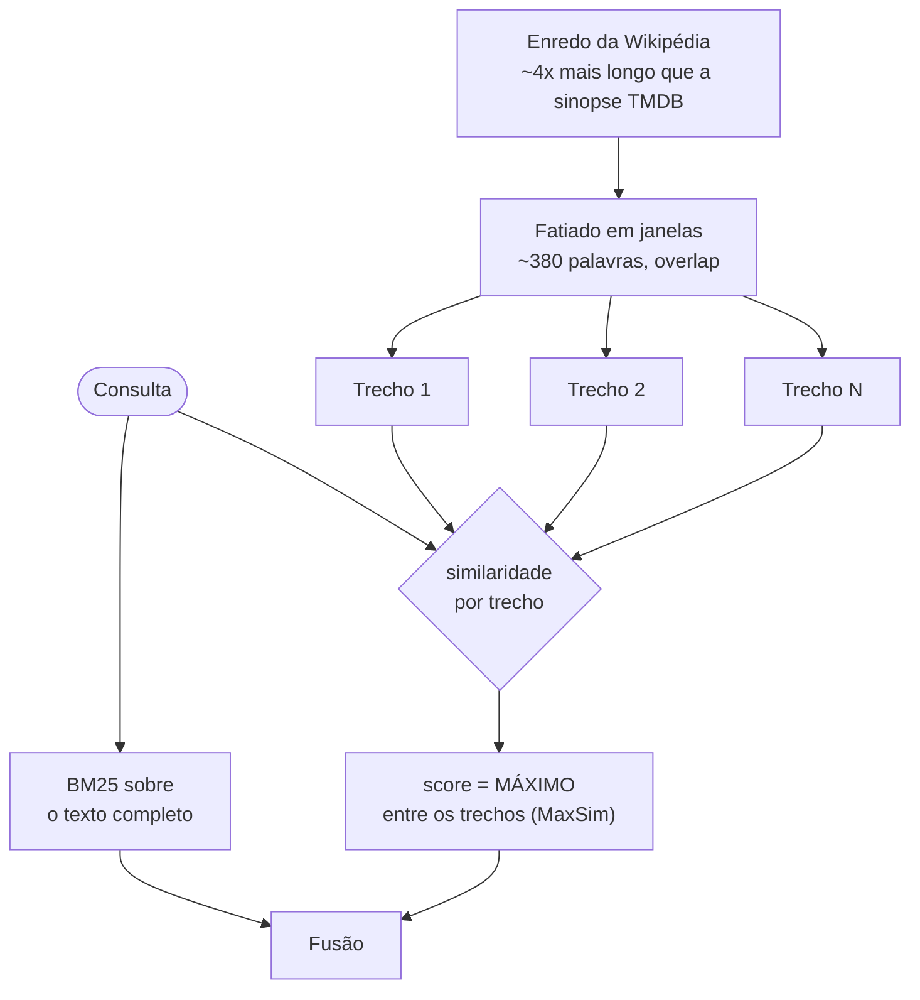

**Por que MaxSim e não a média do documento inteiro**: um filme de 2h só tem o objeto citado numa frase, e calcular um embedding único do texto inteiro dilui esse sinal entre centenas de outras palavras. Tomar o **máximo entre trechos** deixa **um** trecho relevante decidir o score, mesmo cercado de texto irrelevante.

<details>
<summary><b>⚠️ Um bug real: truncar no meio da palavra</b></summary>

A primeira versão cortava o texto da Wikipédia em 4000 caracteres com `texto[:4000]`, cortando **no meio de palavras e de frases**, às vezes antes do próprio clímax do enredo (o final de *A Origem* saiu cortado). Corrigido para cortar no **limite de palavra** e subir o teto para 20.000 caracteres (`core/enrich.py::_clean_wikitext`); os ~2.371 filmes afetados foram reprocessados.

</details>

<details>
<summary><b>📊 Ganho medido (split <code>object</code>, 42 consultas de objeto/veículo específico)</b></summary>

| Config | nDCG@10 | Recall@10 |
|---|---|---|
| Sem canal léxico de enredo | 0,276 | — |
| **Com canal léxico de enredo** (depois do teto de z-score) | **0,325** | 0,48 |

O ganho só apareceu de forma estável **depois** do teto de z-score (ver seção seguinte); antes disso, o canal léxico sobre um texto 4× mais longo produzia outliers que a fusão amplificava em vez de aproveitar.

</details>

---

## ⚖️ Fusão de sinais

> **O que faz** — combina **8 sinais** (BM25, embedding da sinopse, embedding temático, personagem, enredo em 2 formas, trivia de pessoa, nome) numa **escala comum** via padronização z-score **com teto**, aplica **ReLU** e soma com pesos + prior de popularidade.
> **O que resolve** — junta evidências de naturezas diferentes de forma justa, sem que um sinal de escala maior (ou um **outlier de termo raro**) domine os demais.

$$
\text{score}(d) = \sum_i w_i \cdot \text{ReLU}\big(\text{clip}(z_i, \pm 8)\big) + w_{\text{pop}} \cdot \text{prior}
$$

onde $z(x) = \dfrac{x - \mu}{\sigma}$ padroniza cada sinal e $\text{clip}(z, \pm 8)$ capa o z-score em 8 desvios-padrão antes de somar.

<details>
<summary><b>🧠 Por que z-score, ReLU e o teto (clip)</b></summary>

- **z-score** (em vez de min-max): robusto a *outliers* (um filme com score altíssimo não achata os demais) e preserva *quanto* cada sinal separa o filme da média.
- **ReLU($z$)**: cada sinal só **soma** evidência quando está **acima da média**; um filme nunca é penalizado por estar "na média" em algum sinal.
- **O teto (`RECOMENDAI_ZSCORE_CLIP=8`) existe porque o z-score sozinho não é robusto o bastante contra termo raro.** Caso real: a consulta "filme que chove hambúrguer" não achava *Tá Chovendo Hambúrguer*. Um filme não relacionado citava a palavra rara "hambúrguer" **uma vez**; sobre 22 mil documentos onde quase todos têm score zero para esse termo, o desvio-padrão fica minúsculo e o z-score desse único filme **explode** (chegou a 75), dominando a soma sozinho e afogando os outros sinais. Capar em 8 desvios-padrão resolveu isso e subiu **os 5 splits de avaliação ao mesmo tempo** (nenhum piorou): evidência de que era mesmo instabilidade, não sinal real perdido.
- **Peso lexical adaptativo**: consulta curta valoriza mais o BM25 (~0.30); descrição longa o reduz (~0.20), pois paráfrases usam termos diferentes da sinopse.
- **Prior de popularidade** ($w_{\text{pop}}=0.35$): z-score de $\log(\text{vote\\_count})$, desempata a favor do filme mais conhecido quando muitos casam de forma parecida.

| Sinal | Peso base | Env var |
|---|:---:|---|
| Embedding da sinopse | `0.60` | — |
| Temático (keywords) | `0.50` | — |
| Lexical (BM25) | `0.20–0.30` (adaptativo) | — |
| Personagem (fuzzy) | `0.45` | `RECOMENDAI_ENTITY_WEIGHT` |
| Enredo, léxico (Wikipédia) | `0.10` | `RECOMENDAI_PLOT_BM25_WEIGHT` |
| Enredo, trechos/MaxSim (Wikipédia) | `0.50` | `RECOMENDAI_PLOT_CHUNK_WEIGHT` |
| Trivia de pessoa (bio) | `0` (desligado, experimental) | `RECOMENDAI_PERSON_MATCH_WEIGHT` |
| Prior de popularidade | `0.35` | `RECOMENDAI_POP_PRIOR` |

</details>

---

## 🎯 Detecção de intenção

> **O que faz** — classifica a consulta como **nome** ou **descrição** e ajusta o peso entre o sinal de título e o de sinopse.
> **O que resolve** — a mesma caixa de busca atende tanto `"Matrix"` (nome) quanto `"hacker descobre que a realidade é simulada"` (descrição).

A intenção é medida pela força do melhor casamento de título no próprio catálogo — uma referência confiável, já que usa exatamente os títulos disponíveis.

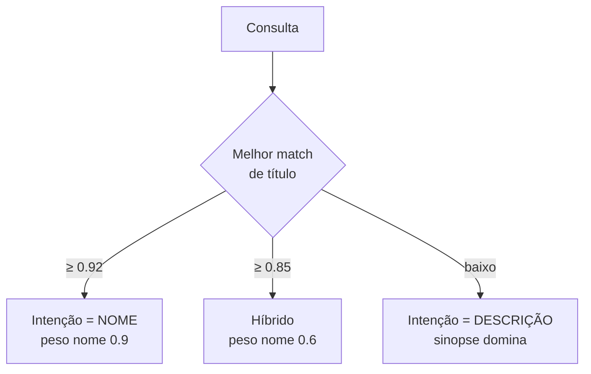

O peso-base também varia com o tamanho da consulta: ≤ 3 palavras tende a ser nome; > 5 palavras tende a ser descrição.

---

## Entendimento de consulta via LLM (Groq)

> **O que faz** — antes da busca, um modelo pequeno e grátis (`openai/gpt-oss-20b`, via [Groq](https://groq.com)) classifica a consulta em **objeto**, **pessoa** ou **genérica**, e extrai pistas (termos literais de objeto; nome/fatos em inglês para trivia de pessoa).
> **O que resolve** — a detecção de intenção acima (nome × descrição) é uma heurística de **tamanho de texto**; ela não sabe dizer se uma descrição curta é sobre um *objeto específico* que precisa de peso diferente na fusão, nem consegue extrair a pista certa para casar contra trivia de pessoa. O LLM lê a consulta e decide isso de verdade: o mesmo problema que motivou trocar a heurística de tamanho por julgamento, aplicado a um passo antes da busca.

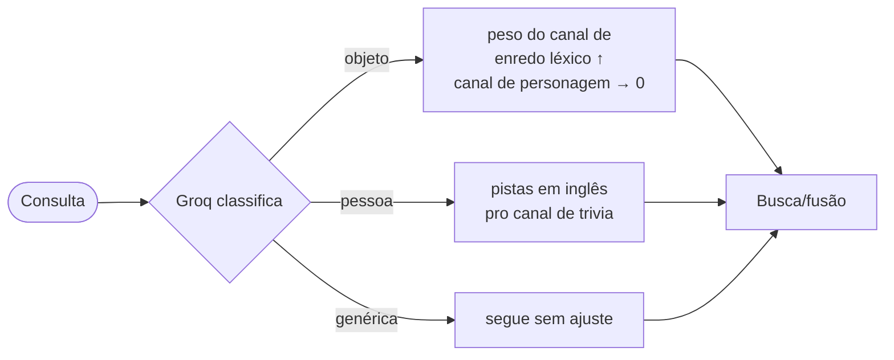

**Regra de segurança: a reescrita só acrescenta termo, nunca substitui a consulta original.** Uma versão anterior tentava *reescrever* a consulta (corrigir ortografia, resumir), e quebrou casos que já funcionavam (uma consulta perdeu peso de nome porque ficou curta demais, outra virou uma substring genérica que casava qualquer título). Reescrever é arriscado porque a consulta original já alimenta heurísticas afinadas (peso de nome, canal de personagem); **acrescentar** pistas extraídas é seguro porque não tira informação que já funcionava.

Cada resultado é **cacheado por texto de consulta** (`data/tmdb_cache/query_llm.json`): só a resposta bem-sucedida, nunca uma falha de rede/timeout. Sem `GROQ_API_KEY`, esse passo simplesmente não roda e a busca segue no comportamento anterior.

---

## 🎬 Busca facetada

> **O que faz** — diretor e ator **restringem** o conjunto (o filme precisa tê-los, via tabela `movie_people`) e a consulta livre **ranqueia** dentro dele; aceita filtros de **ano, gênero e idioma**.
> **O que resolve** — afunilar a busca combinando tudo o que o usuário souber.

Num conjunto já restrito por uma pessoa, o texto quase sempre descreve o enredo, então o sinal de sinopse recebe peso maior do que na busca global.

---

## 🔁 Re-ranking com cross-encoder — *desligado em produção*

> **O que faz** — pegaria os *N* melhores candidatos da primeira etapa e os re-pontuaria com um **cross-encoder**, que lê a consulta e a sinopse **juntas**.
> **Por que fica off** — a avaliação (`python -m eval.run --sweep-rerank`) não achou ganho confiável, e o custo de latência é de ~250×. `RECOMENDAI_RERANK=1` liga para experimentos.

$$
\text{score}_{\text{final}} = \text{blend} \cdot \text{score}_{\text{recuperação}} + (1 - \text{blend}) \cdot \text{score}_{\text{cross-encoder}}, \quad \text{blend}=0.5
$$

<details>
<summary><b>📊 Ablação por sinal (split de teste, 47 consultas <i>held-out</i>)</b></summary>

Medido por `python -m eval.run` (ver [`eval/`](../eval/README.md)). Recuperação *known-item*, e5-large.

| Pipeline | nDCG@10 | MRR | Recall@50 | mediana |
|---|---|---|---|---|
| BM25 puro (lexical) | 0,360 | 0,316 | 0,66 | #7 |
| Só embedding (semântico) | 0,299 | 0,260 | 0,53 | #25 |
| Só temático (keywords) | 0,282 | 0,246 | 0,58 | #32 |
| **Fusão** (8 sinais, produção) | **0,829** | **0,790** | **1,00** | **#1** |

A fusão dispara acima de qualquer sinal isolado (complementares). No split de **calibração** (dev, 95 consultas) a fusão chega a **nDCG@10 0,88 / MRR 0,86**; a diferença dev→teste é o quanto o número "de casa" está otimista.

</details>

<details>
<summary><b>📊 Varredura do cross-encoder — por que fica desligado (split de teste)</b></summary>

> Números abaixo medidos **antes** do teto de z-score e dos canais de personagem/enredo (baseline "off" era 0,733; hoje a fusão está em 0,829). A leitura relativa não mudou: um datapoint fresco contra a fusão atual confirma **0,829 → 0,830** a 694 ms vs 18 ms, a mesma margem dentro do ruído.

| pool | nDCG@10 | MRR | Recall@50 | latência p50 |
|---|---|---|---|---|
| **0 (off, produção na época)** | 0,733 | 0,686 | 0,94 | **7 ms** |
| 20 | 0,750 | 0,699 | 0,94 | 124 ms |
| 50 | 0,754 | 0,705 | 0,94 | 304 ms |
| 300 (default antigo) | 0,740 | 0,694 | 0,92 | ~2,4 s |

O melhor pool (50) sobe o nDCG@10 em +0,02 no teste, mas **cai** 0,823 → 0,814 no dev — ruído para *n* = 47–95. O pool 300 antigo era o pior: qualidade abaixo do pool 50 *e* Recall@50 menor, a ~1,8 s/busca. Trocar o L12 por um **MiniLM-L6** multilíngue (`eval.bench rerank`) piora ainda mais — nDCG@10 0,705 @ pool 50, *abaixo* da fusão sem re-ranker. Decisão: `RECOMENDAI_RERANK=0` por padrão; se ligar, L12 + `RECOMENDAI_RERANK_POOL=50`.

</details>

---

## Reranking via LLM (lê e julga)

> **O que faz** — manda o **top-20** da fusão pro Groq (modelo `qwen/qwen3.8-27b`, diferente do usado no entendimento de consulta), junto com a sinopse **completa** de cada candidato (não a versão truncada de 240 caracteres do card). O modelo devolve `{"confirmados": [{"n": N, "confianca": "alta"|"media"}, ...]}`, uma lista, não um único palpite; todos os confirmados vão pro topo, na ordem de confiança, e **o resto da lista mantém a ordem original da fusão**.
> **Em que é diferente do cross-encoder acima** — o cross-encoder também lê consulta+texto juntos, mas devolve um **score de similaridade** (não sabe *por que* casou). O reranking por LLM **julga um fato**: lê o candidato e decide se o que a consulta descreve está mesmo ali. É a única etapa do pipeline inteiro que faz isso.

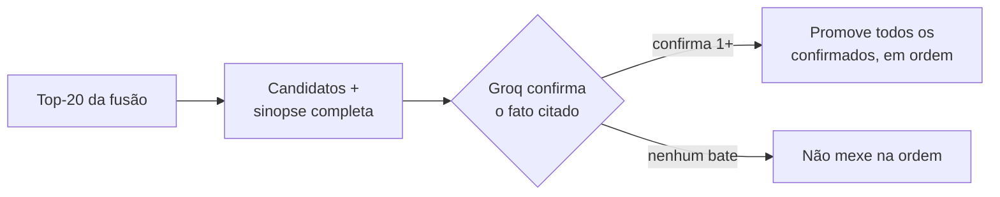

**Por que isso ajuda onde o cross-encoder não ajudou**: o cross-encoder erra pelo mesmo motivo que os sinais de similaridade, porque também mede "quão parecido", só que consulta+texto juntos em vez de separados. Numa consulta oblíqua (split `hard`), o candidato certo pode ser menos "parecido" textualmente do que um distrator popular. Ler o conteúdo e confirmar/negar o fato é uma categoria de decisão diferente.

<details>
<summary><b>Por que confirmar uma lista, e não pedir pra reordenar os 20 inteiros</b></summary>

A primeira versão só pedia um palpite (`{"escolha": N}`), e promovia um único candidato. Isso tem um problema real: quando a descrição é genuinamente compatível com mais de um filme (ex.: "sonho dentro do sonho" bate tanto com *A Origem* quanto com *O Discreto Charme da Burguesia*, que cita a frase "sonhos dentro de sonhos" literalmente na sinopse), só um dos dois subia; o outro ficava onde a fusão o tivesse deixado, às vezes bem longe do topo.

A alternativa óbvia seria pedir pro LLM reordenar os 20 candidatos inteiros, já que ele lê todas as sinopses mesmo. Descartada por dois motivos: reordenar uma lista inteira é um formato de saída bem mais frágil de validar (índice fora de ordem, duplicata, item faltando) do que uma lista curta de confirmações; e pede pro modelo discriminar entre candidatos onde ele não tem base real nenhuma, quando a maioria do pool não tem relação alguma com a consulta. Confirmar uma lista curta pede o mesmo julgamento binário de antes (esse candidato bate ou não), só que repetido por candidato, em vez de reordenar tudo.

</details>

<details>
<summary><b>Ganho medido (splits <code>hard</code>, <code>object</code> e <code>entity</code>, medição ad hoc contra a Groq real)</b></summary>

| Split | nDCG@10 antes | nDCG@10 depois | mediana antes | mediana depois |
|---|---|---|---|---|
| `hard` (30, consulta oblíqua) | 0,473 | **0,654** | #3 | **#1** |
| `object` (42, objeto/veículo específico) | 0,325 | **0,468** | #13 | **#5** |
| `entity` (20, nome com erro de grafia) | 0,778 | **0,853** | #1 | #1 |

Não é medido dentro do `eval.run`: esse harness é determinístico e sem chamada de rede de propósito (reprodutibilidade em CI, sem custo/latência de API por PR). Os números acima vieram de um script ad hoc chamando a Groq de verdade. O ganho no `object` é bem maior que na primeira versão (que quase não ajudava ali): boa parte desse split é objeto/personagem de franquia (o mesmo carro, boneco ou vilão aparece em várias continuações), exatamente o caso que confirmar uma lista resolve.

</details>

<details>
<summary><b>Achado no caminho: raciocínio oculto caro, e um modelo sem raciocínio oculto que examina a lista melhor</b></summary>

Testando "sonho dentro do sonho" ao vivo: com o modelo de entendimento de consulta (`openai/gpt-oss-20b`, um modelo de "raciocínio") em `reasoning_effort="low"`, o reranking pulava o exame item a item da lista de 20 a 30 candidatos e respondia pela memória do modelo ("A Origem é filme de sonho dentro de sonho") em vez de checar o texto de cada um; a *reasoning trace* mostrava literalmente "Inception? None listed", e o modelo devolvia uma lista vazia mesmo com *O Discreto Charme da Burguesia* tendo a frase "sonhos dentro de sonhos" na própria sinopse.

Subir pra `reasoning_effort="medium"` resolvia: o modelo varria a lista inteira e confirmava os dois candidatos certos. Mas o raciocínio oculto de um modelo de raciocínio em "medium" é caro, algo como 9 a 10 mil tokens por chamada, contra uma cota Groq grátis de 200 mil tokens por **dia** (não por minuto) para aquele modelo específico, cota essa **compartilhada** com o entendimento de consulta, que roda em toda busca. Em ~20 chamadas de teste a cota do dia acabou.

Trocar o modelo do reranking para `qwen/qwen3.8-27b` (sem raciocínio oculto) resolveu os dois problemas de uma vez: examina a lista inteira corretamente e responde o JSON direto, sem gastar token "pensando", em torno de 1800 a 4000 tokens por chamada dependendo do tamanho do pool. Por ser um modelo diferente do usado no entendimento de consulta, também tem cota diária própria, então as duas etapas de LLM não competem mais pelo mesmo orçamento.

</details>

<details>
<summary><b>Achado no caminho: a Groq não é perfeitamente determinística</b></summary>

Mesmo com `temperature=0`, a mesma consulta repetida 8 vezes contra o mesmo conjunto de candidatos deu **3 respostas diferentes**, efeito de lote/roteamento na infraestrutura de inferência compartilhada da Groq, não um bug local. Corrigido com **cache de aplicação** por (consulta, IDs ordenados dos candidatos) em `data/tmdb_cache/rerank_llm.json`, cacheando só resposta bem-sucedida (nunca falha de rede/timeout). O cache resolve **consistência** (a mesma busca sempre dá a mesma resposta) mas não **correção**: trava na primeira resposta real, que pode não ser a "melhor" entre respostas plausíveis.

</details>

Decisão e trade-offs completos: [`docs/adr/0003-llm-in-the-loop.md`](adr/0003-llm-in-the-loop.md).

---

## Reagrupamento por franquia

> **O que faz** — depois de todo o resto do pipeline (fusão, facetas, reranking), se o **#1** pertence a uma franquia (`belongs_to_collection` da TMDB) **e** o entendimento de consulta classificou a busca como objeto ou pessoa, traz os outros filmes dela pra perto, mesmo que a fusão os tenha ranqueado longe do topo (`core/inference_client.py::_pull_franchise_siblings`, cache TMDB de 3 dias).
> **O que resolve** — quando a consulta cita um detalhe específico de UMA sequência de uma franquia grande e nenhum canal de similaridade acha o texto exato, mas o algoritmo já acertou a franquia certa.

Caso real: "Nissan Skyline azul e prata arrancada" tem como resposta certa *+ Velozes + Furiosos* (2003, o carro é daquele filme especificamente), mas a sinopse da TMDB desse filme não cita carro, cor nem franquia, e não há enredo da Wikipédia enriquecido pra ele. A fusão e o reranking até acertavam a franquia (havia 4 filmes de Velozes e Furiosos no pool de 20), mas erravam qual sequência específica: o certo ficava na posição #15.

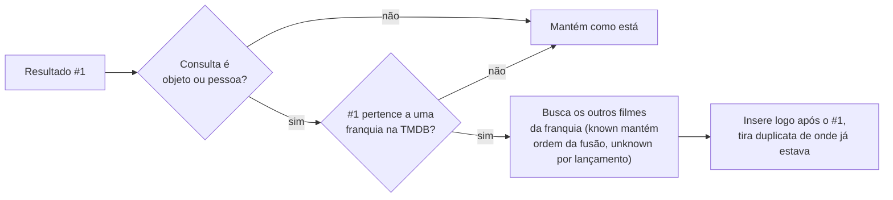

<details>
<summary><b>Por que reagrupar em vez de pedir pra LLM adivinhar a sequência certa</b></summary>

A alternativa cogitada era deixar o reranking confirmar por conhecimento próprio do modelo, não só pela sinopse fornecida (já que o modelo provavelmente "sabe" que o Skyline azul é de um Velozes e Furiosos específico). Descartada porque o pool tinha 4 filmes da mesma franquia ao mesmo tempo: o modelo precisaria acertar especificamente **qual dos 4** tem aquele carro, não só reconhecer "isso é Velozes e Furiosos" (fácil, qualquer modelo sabe). É uma aposta bem mais específica no conhecimento de mundo do modelo do que parece à primeira vista, com risco real de confundir qual sequência exata.

Reagrupar pela franquia ataca o mesmo problema por um caminho mais barato e confiável: não depende de o modelo acertar a sequência exata, só de ele (ou a fusão) acertar a franquia, o que já acontecia. O usuário reconhece visualmente qual filme é o certo assim que a franquia inteira aparece na tela.

</details>

<details>
<summary><b>Achado no caminho: subiu pra produção só com 2 exemplos escolhidos a dedo, sem medir o impacto agregado; corrigido no mesmo dia</b></summary>

A 1ª versão inseria os filmes da franquia sempre (qualquer tipo de consulta) e só em ordem de lançamento. Validada com 2 exemplos reais (Velozes e Furiosos, James Bond) e subida sem medir o efeito no dataset inteiro. Medindo depois nos 5 splits formais (essa etapa não usa LLM, então dá pra medir sem custo de Groq): `test` piorou (nDCG@10 -0,006) e, pior que a média agregada, **toda consulta onde o #1 já estava certo e pertencia a alguma franquia** tinha risco real de regressão. O exemplo mais claro foi "Hobbs e Toreto" (split `entity`): *Velozes & Furiosos 7* já estava certo em #3, e caiu pra #7 porque um filme mais antigo da mesma franquia (irrelevante pra aquela consulta específica) entrou na frente só por ter saído antes nos cinemas.

Dois ajustes, remedidos antes de religar em produção:

| Ajuste | Por quê |
|---|---|
| Só ativa quando o entendimento de consulta classifica como objeto ou pessoa | Descrição genérica de enredo (a maioria de `dev`/`test`/`hard`) raramente tem a ver com a franquia do #1; zerar a ativação ali eliminou o risco por completo (medido: 0 disparos, 0 mudança nesses 3 splits) |
| Filmes que já apareciam nos resultados ("known") mantêm a ordem relativa que a fusão/reranking já tinham decidido entre eles; só os de fora do pool ("unknown", sem sinal de relevância nenhum) usam ordem de lançamento | Resolve o caso "Hobbs e Toreto": o filme já bem ranqueado não é mais ultrapassado por um sibling mais antigo mas irrelevante |

Remedido: `entity` nDCG@10 0,778 → 0,780 (zero regressões, antes tinha 3), `object` 0,325 → 0,340 (mediana #13 → #11, melhor que a 1ª tentativa, que só ia a 0,328).

</details>

Sem teto artificial de quantos filmes trazer: uma franquia grande (ex. James Bond, ~25 filmes) pode ocupar a página de resultados inteira. Decisão de produto: o objetivo é achar o filme certo, não garantir variedade na página.

---

## 🧮 Encoder da consulta — precisão, tamanho e latência

> **O que faz** — o mesmo modelo que gerou o índice codifica a consulta num vetor. É a etapa mais cara da busca quando a consulta não está no cache LRU.
> **O que resolve** — em produção (CPU, sem GPU) esse *forward* domina a latência de cauda; o modelo também é o maior item de RAM do processo.

Otimizações aplicadas (ver [`eval/`](../eval/README.md)):

1. **Cache LRU** por string de consulta (`RECOMENDAI_QUERY_CACHE`): acerto = ~0 ms (elimina o *forward*). Consultas repetem muito entre usuários.
2. **Preload no boot**: `SearchEngine.warmup()` no import do `app.py` — o modelo carrega no startup, nunca na 1ª requisição.
3. **Benchmark de modelo/precisão** (`python -m eval.bench embed`, CPU, split de teste):

> Medido antes do teto de z-score e dos canais de personagem/enredo (`nDCG@10` usa o baseline antigo, 0,733; hoje a fusão está em 0,829). A leitura relativa entre as três configurações não depende disso.

| config | dim | nDCG@10 | Recall@10 | `encode` p50 / p99 | RSS |
|---|---|---|---|---|---|
| **e5-large fp32** (padrão) | 1024 | **0,733** | **0,89** | 169 / 352 ms | 2,3 GB |
| e5-large INT8 (ONNX) | 1024 | 0,729 | 0,89 | 212 / 369 ms | 1,7 GB |
| e5-small fp32 | 384 | 0,693 | 0,83 | **22 / 105 ms** | **1,0 GB** |

**INT8 dinâmico** (`retrieval/onnx_embed.py`, quantização de pesos → INT8, cos vs fp32 = 0,993): mantém a qualidade e corta 28 % de RAM, mas **não acelera** o *encode* em CPU ARM (sem VNNI). **e5-small** é o único que corta latência (7,7× no p50) e RAM (pela metade), ao custo de nDCG@10 −0,04 / Recall@10 −6 pp — o **Recall@50 fica igual**. Padrão continua e5-large fp32; `RECOMENDAI_INDEX_DIR=retrieval/index_e5small` troca para o modo baixa-latência.

---

## 🌐 Busca multilíngue via TMDB

> **O que faz** — quando o casamento local (títulos em português) é fraco e a consulta parece um título (≤ 8 palavras), consulta a `/search/movie` da TMDB, valida a similaridade ao `title`/`original_title` retornados e mapeia o resultado para o catálogo.
> **O que resolve** — busca por títulos em **outros idiomas** (ex.: `"The Godfather"` → *O Poderoso Chefão*).

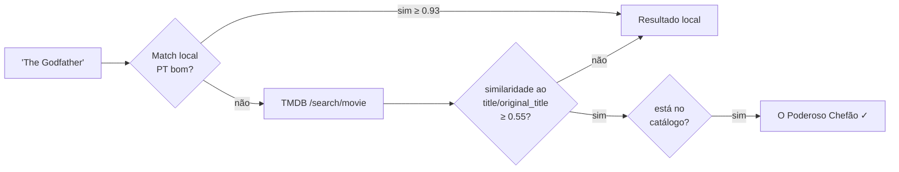

A confiança vem da **similaridade real** ao título devolvido pela TMDB, com a pontuação normalizada (hífen e pontuação não penalizam). Os resultados são **cacheados em disco** e o sistema degrada com elegância quando não há rede.

---

## 🔬 Explicabilidade

> **O que faz** — anexa a cada resultado o **porquê** de ele ter aparecido.
> **O que resolve** — transparência: o usuário vê quais sinais casaram e com qual confiança.

| Componente | O que mostra | Como é calculado |
|---|---|---|
| **Confiança** (0–100) | quão bem o filme casa, em absoluto | logística sobre o z-score do melhor sinal: $\frac{1}{1+e^{-0.85(z-1.4)}}$ |
| **Relevância** (0–100) | posição relativa *nesta* busca | min-max dentro do conjunto retornado |
| **Barra de sinais** | quanto cada sinal pesou | fração da contribuição positiva |
| **Chips de tema** | keywords que casaram | cosseno consulta↔keyword (multilíngue) |

---

## 🧭 Pipeline do SRI

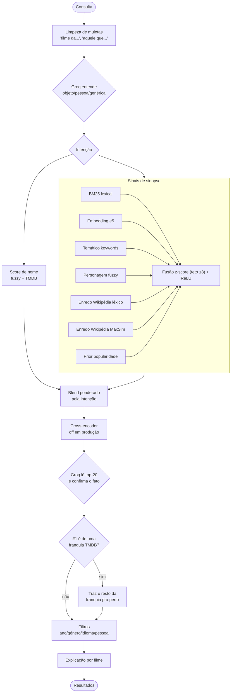

---

# 🍿 Parte 2 — Recomendação: traçar o perfil

> **Objetivo:** a partir do que o usuário ama (filmes escolhidos ou o Letterboxd, **com notas e resenhas**), prever o que ele ainda não viu e vai gostar — inclusive quando o gosto é **multi-modal** (vários estilos distintos ao mesmo tempo).

## Técnicas em resumo (Recsys)

| Técnica | O que faz | O que resolve | Arquivo |
|---|---|---|---|
| **Colaborativo (SVD)** | prevê a nota por fatores latentes de co-avaliação | "quem avalia parecido gostou de X" | [`train.py`](../recommender/train.py) |
| **Fold-in** | encaixa um usuário novo sem retreinar | recomendar para quem acabou de chegar | [`collaborative.py`](../recommender/collaborative.py) |
| **Relevance feedback** | positivos puxam, negativos empurram | usar notas baixas e resenhas ruins | [`profile.py`](../recommender/profile.py) |
| **Multi-interesse** | agrupa o gosto em K vetores | gostos múltiplos sem virar média genérica | [`profile.py`](../recommender/profile.py) |
| **Reviews por filme** | embute a resenha no vetor do filme | aproveitar o que a pessoa articula | [`profile.py`](../recommender/profile.py) |
| **De-viés + MMR** | remove o genérico e diversifica | evitar blockbuster óbvio e repetição | [`profile.py`](../recommender/profile.py) |
| **Round-robin ponderado** | intercala candidatos por interesse | representar todos os gostos | [`profile.py`](../recommender/profile.py) |
| **Fusão híbrida (RRF)** | combina conteúdo + colaborativo | precisão e serendipidade juntas | [`profile.py`](../recommender/profile.py) |
| **Parecidos (item-item)** | acha similares a um filme-semente | "gostei de X, quero mais como X" | [`similar.py`](../recommender/similar.py) |

---

## 🤝 Filtragem colaborativa (SVD)

> **O que faz** — fatora a matriz **usuário × item** de notas reais em **fatores latentes** (estilo *Funk-SVD*) e prevê a nota que um usuário daria a um filme.
> **O que resolve** — capta padrões de co-avaliação: "pessoas com gosto parecido com o seu gostaram de X", mesmo sem analisar o conteúdo do filme.

$$
\hat{r}_{ui} = \mu + b_i + \vec{q}_i \cdot \vec{p}_u
$$

onde $\mu$ = média global, $b_i$ = viés do item, $\vec{q}_i$ = fatores do item, $\vec{p}_u$ = fatores do usuário.

<details>
<summary><b>📊 O modelo treinado (dados reais)</b></summary>

| Métrica | Valor |
|---|---|
| Avaliações (amostra de treino) | **10.000.000** |
| Usuários | **200.943** |
| Filmes | **19.206** |
| Fatores latentes ($k$) | 64 |
| Épocas | 20 |
| **RMSE** (holdout) | **0,829** |
| **MAE** (holdout) | **0,626** |
| Escala | 0,5 – 5,0 |

Treinado por [`recommender/train.py`](../recommender/train.py) (`--n-factors 64 --sample 10000000`) sobre uma amostra de 10 M avaliações do conjunto completo MovieLens ml-32m reconciliado (30,9 M avaliações · 200,9 k usuários · 19,7 k filmes; ver [proveniência](../README.md#-proveniência-dos-dados)) — amostrado por custo de treino em lote completo, não por limite de qualidade. Os fatores ($q_i$, $b_i$, $\mu$) ficam serializados em `.npy` (`recommender/weights/meta.json` registra a config e as métricas de cada treino) para inferência em milissegundos.

</details>

---

## 🧩 Fold-in e fallbacks

> **O que faz** — para um usuário **novo** (que não estava no treino), resolve o vetor latente $\vec{p}$ por **regressão ridge** sobre os itens que ele já avaliou, sem retreinar o modelo.
> **O que resolve** — recomendar para quem acabou de importar o Letterboxd ou escolher filmes agora.

$$
\vec{p} = \arg\min_{\vec{p}} \lVert \vec{y} - Q\vec{p} \rVert^2 + \lambda \lVert \vec{p} \rVert^2 \;\Rightarrow\; \vec{p} = (Q^\top Q + \lambda I)^{-1} Q^\top \vec{y}, \quad \vec{y} = r - \mu - b_i
$$

<details>
<summary><b>🧠 Cascata de estratégias e ajuste do viés</b></summary>

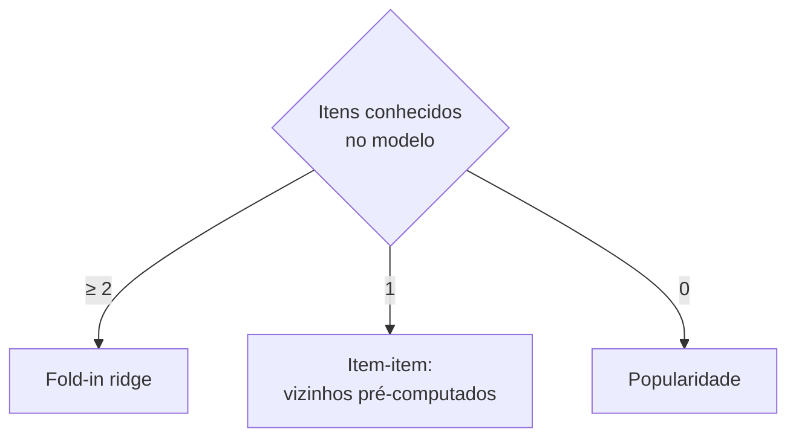

- **Ajuste do viés** ($b_i$): no ranking usa-se $\mu + 0.5\,b_i + \vec{q}_i\cdot\vec{p}$. Reduzir o peso do viés de item privilegia o **casamento de gosto** ($\vec{q}_i\cdot\vec{p}$) em vez de empurrar clássicos universais para qualquer perfil.
- **Item-item**: com poucos itens conhecidos, agrega os vizinhos mais próximos pré-computados.
- **Popularidade**: fallback quando nada se sabe do usuário.

</details>

---

## ➕➖ Relevance feedback (Rocchio)

> **O que faz** — o perfil é **puxado** pelos filmes bem avaliados e **empurrado** pelos mal avaliados; o peso é graduado pela nota.
> **O que resolve** — aproveita o sinal **negativo** (notas baixas e resenhas ruins), e não só o que a pessoa gostou.

$$
\vec{perfil} = \alpha \cdot \text{centroide}(\text{amados}) - \beta \cdot \text{centroide}(\text{detestados})
$$

Pesos graduados pela nota (escala Letterboxd 0.5–5.0):

$$
w^{+}(r) = r - 2.5 \quad (5\star \to 2.5,\; 4\star \to 1.5) \qquad w^{-}(r) = 3.0 - r \quad (0.5\star \to 2.5)
$$

Na prática, antipatias por um estilo afastam as recomendações daquele estilo, refinando o perfil para além do que os "amados" sozinhos indicariam.

---

## 🎭 Perfil multi-interesse

> **O que faz** — agrupa os filmes amados em **K interesses** com **k-means esférico** e pontua cada candidato pelo **melhor** interesse (*max-pooling*).
> **O que resolve** — representa gostos **múltiplos e distintos** (ex.: ficção científica, romance e terror) sem fundi-los numa média.

Um único vetor médio de gostos diferentes aponta para o **centro** do espaço de embeddings — onde estão os filmes mais genéricos. O perfil multi-interesse evita isso ao manter um vetor por gosto e deixar cada candidato casar com o seu interesse mais próximo.

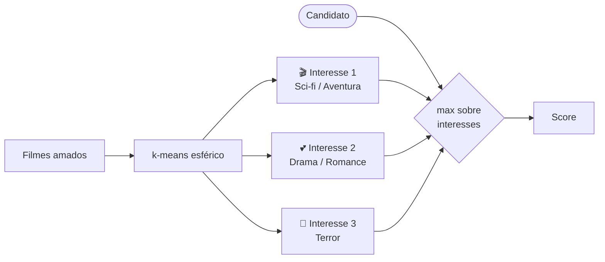

$$
K = \text{clip}\!\left(\text{round}(n_{\text{amados}}/4),\; 1,\; 5\right) \qquad \text{score}(c) = \max_{k}\; z\big(\vec{c}\cdot\vec{I}_k^{\text{syn}} + w_{\text{kw}}\,\vec{c}\cdot\vec{I}_k^{\text{kw}}\big) - \text{penalidades}
$$

Cada interesse é padronizado **separadamente**, de modo que um gosto de **nicho** compete em pé de igualdade com um gosto popular. É a abordagem das técnicas de *multi-interest recommendation* (MIND, ComiRec), aqui em uma versão tratável por usuário.

---

## ✍️ Reviews por filme

> **O que faz** — embute o texto de cada resenha e o mistura ao vetor **daquele** filme específico.
> **O que resolve** — incorpora **o que a pessoa articula** (tom, temas que destacou) ao definir o gosto, em vez de tratar todas as resenhas como um bloco único.

$$
\vec{v}_i = \text{norm}\big((1 - \rho)\,\vec{v}_i^{\,\text{sinopse}} + \rho\,\vec{v}_i^{\,\text{review}}\big), \quad \rho = 0.30
$$

---

## 🧹 De-viés de genericidade e MMR

> **O que faz** — subtrai do score a semelhança do candidato com a **direção média** do catálogo (genericidade) e reordena o topo com **MMR** para diversificar.
> **O que resolve** — evita recomendar o blockbuster óbvio que "parece com todo filme" e impede listas repetitivas (várias sequências do mesmo título).

$$
\text{MMR}(c) = \lambda \cdot \text{rel}(c) - (1 - \lambda)\,\max_{s \in S}\, \text{sim}(c, s), \quad \lambda = 0.72
$$

O termo de genericidade trata a chamada *hubness* — a tendência de itens centrais aparecerem para todos os perfis.

---

## 🔄 Round-robin ponderado

> **O que faz** — cada interesse recupera os **seus próprios** candidatos, que são intercalados num round-robin proporcional ao peso do interesse.
> **O que resolve** — garante que **todos os gostos** apareçam na recomendação, na proporção certa, sem o gosto mais coeso abafar os demais.

Por exemplo, um perfil com mais filmes de ficção científica do que de romance recebe recomendações nessa mesma proporção. É a forma como modelos multi-interesse agregam, em *serving*, as K listas (uma por interesse).

---

## 🔗 Fusão híbrida (RRF)

> **O que faz** — funde o ranking de **conteúdo** (multi-interesse) com o de **colaborativo** (SVD) por **Reciprocal Rank Fusion**, que combina pela **posição**, não pelo score cru.
> **O que resolve** — une a precisão do conteúdo com a **serendipidade** da co-avaliação real, sem depender de escalas comparáveis entre os dois sinais.

$$
\text{score}(d) = \sum_{r \in \{\text{conteúdo, colab}\}} \frac{w_r}{k + \text{rank}_r(d)}, \quad k = 20,\; w_{\text{cont}}=1.0,\; w_{\text{colab}}=0.5
$$

---

## 🎯 Filmes parecidos (item-to-item)

> **O que faz** — a partir de **um** filme-semente, recupera os mais parecidos fundindo dois sinais: **similaridade de conteúdo** (embeddings e5) e **vizinhos colaborativos** item-item do SVD.
> **O que resolve** — "gostei de *Blade Runner*, me dá parecidos que talvez eu goste" — recomendação imediata, sem precisar traçar um perfil inteiro a partir de vários filmes.

Diferente do perfil (que parte de *vários* filmes com notas), aqui a semente é **um** título. Os dois motores que o projeto já tem entram em jogo:

| Sinal | O que captura | De onde vem |
|---|---|---|
| **Conteúdo (e5)** | "tem a mesma cara/tema" (replicante, dystopia, neo-noir) | índice de embeddings (sinopse + temático) |
| **Colaborativo (item-item)** | "quem gostou deste também gostou" | vizinhos pré-computados do SVD |

### Cosseno centralizado (de-viés de hubness)

A similaridade de conteúdo crua sofre de **hubness**: blockbusters de ação que "parecem com todo filme" ficam no centro do espaço de embeddings e invadem qualquer lista de parecidos (ex.: *Velozes & Furiosos* surgindo como similar a *Blade Runner*). Para corrigir, comparamos no espaço **centralizado** — subtraindo a direção média do catálogo $\mu$ antes do cosseno:

$$
\text{sim}(a, i) = \frac{(\vec{m}_a - \mu)\cdot(\vec{m}_i - \mu)}{\lVert \vec{m}_a - \mu\rVert\,\lVert \vec{m}_i - \mu\rVert}
$$

Remover $\mu$ tira o componente comum (o "hub") de forma **simétrica**, deixando só o que **distingue** os filmes. É o de-viés de genericidade do perfil, na sua forma mais limpa. O score de conteúdo soma os dois embeddings, com o **temático pesando mais** que no perfil:

$$
\text{score}_{\text{cont}}(i) = \text{sim}_{\text{sinopse}}(a, i) + w_{\text{kw}} \cdot \text{sim}_{\text{temático}}(a, i), \quad w_{\text{kw}} = 1.5
$$

<details>
<summary><b>🧠 Por que o temático pesa mais aqui (1.5 vs. 0.5 no perfil)</b></summary>

O que define "mesmo **tipo** de filme" é o **tema/gênero** (dystopia, IA, android), não o vocabulário de ação da sinopse — duas sinopses cheias de "agente", "perseguição" e "explosão" ficam próximas mesmo sendo filmes muito diferentes. Subir o peso temático afasta a ação genérica e aproxima os parecidos de verdade (validado em sci-fi, romance, terror, máfia e franquias).

**Forma fechada:** o cosseno centralizado é calculado **sem** materializar uma cópia centralizada da matriz $N\times D$ — usando $\lVert \vec{m}_i - \mu\rVert = \sqrt{1 - 2(\vec{m}_i\cdot\mu) + \mu\cdot\mu}$ (válido porque $\vec{m}_i$ é L2-normalizado). Isso economiza ~180 MB de RAM no servidor.

</details>

### Fusão e degradação graciosa

Os rankings de conteúdo e colaborativo são fundidos por **RRF** (igual ao perfil), com o conteúdo mandando:

$$
\text{score}(d) = \frac{w_{\text{cont}}}{k + \text{rank}_{\text{cont}}(d)} + \frac{w_{\text{colab}}}{k + \text{rank}_{\text{colab}}(d)}, \quad k=20,\; w_{\text{cont}}=1.0,\; w_{\text{colab}}=0.6
$$


Um **lançamento recente** ainda não tem sinal colaborativo (não estava no treino do SVD) — nesse caso a lista usa **só conteúdo**, sem quebrar. O mesmo vale ao contrário: filme fora do índice de conteúdo cai no colaborativo. Exposto pela rota `GET /similar/<tmdb_id>`.

---

## 📥 Ingestão do Letterboxd

> **O que faz** — lê o `ratings.csv` exportado do Letterboxd, resolve cada filme para o `tmdb_id` e monta a entrada do perfil.
> **O que resolve** — transforma o histórico real do usuário (notas e resenhas) em sinal para o motor de recomendação.

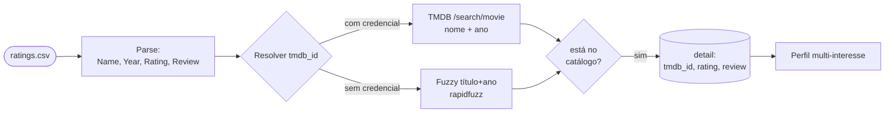

A escala de nota do Letterboxd (0.5–5.0) é a mesma do modelo — sem reescalar. A resenha, quando presente, alimenta a técnica de [reviews por filme](#-reviews-por-filme).

---

## 🧭 Pipeline da recomendação

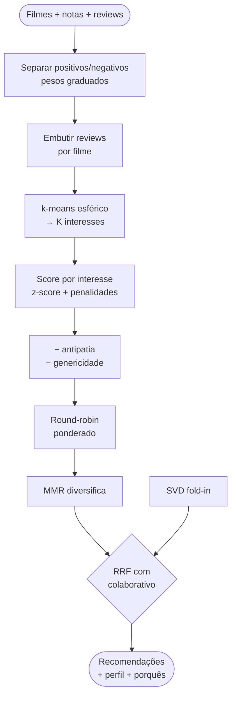

---

## 📚 Glossário

| Termo | Significado |
|---|---|
| **SRI** | Sistema de Recuperação de Informação (encontrar, não recomendar) |
| **BM25** | Função de ranking lexical; TF-IDF saturado e normalizado por tamanho |
| **Embedding** | Vetor denso que representa o *sentido* de um texto |
| **Cosseno** | Medida de similaridade entre vetores (ângulo) |
| **z-score** | Padronização $(x-\mu)/\sigma$ para comparar escalas diferentes |
| **ReLU** | $\max(0, x)$ — aqui, "só soma evidência positiva" |
| **SVD** | Fatoração da matriz de notas em fatores latentes |
| **Fold-in** | Encaixar um usuário novo sem retreinar o modelo |
| **Rocchio** | Relevance feedback: positivos puxam, negativos empurram |
| **Multi-interesse** | Representar o gosto por vários vetores, não um |
| **MMR** | Re-ranking que equilibra relevância e diversidade |
| **RRF** | Fusão de rankings por posição recíproca |
| **Cross-encoder** | Modelo que lê consulta e documento juntos (preciso, mais lento) |
| **Hubness** | Tendência de itens "centrais" aparecerem para todos os perfis |

---

## 🗂️ Mapa de arquivos

```
Cinerd/
├── retrieval/                    🔎 SRI
│   ├── search_engine.py          fusão (8 sinais), intenção, facetas, fallback TMDB, explicação
│   ├── bm25.py                   sinal lexical (BM25)
│   ├── index_builder.py          constrói embeddings (e5) + índice BM25 + trechos/MaxSim + bios
│   ├── reranker.py               cross-encoder (2ª etapa, off em produção)
│   └── query_expander.py         tradução PT→EN opcional p/ keywords
├── recommender/                  🍿 Recomendação
│   ├── profile.py                multi-interesse, Rocchio, reviews, MMR, RRF
│   ├── similar.py                filmes parecidos (item-to-item): cosseno centralizado + colaborativo
│   ├── collaborative.py          SVD fold-in, item-item, fallbacks
│   ├── train.py                  treina o SVD nos ratings reais
│   └── letterboxd.py             ingestão do ratings.csv
├── core/
│   ├── catalog.py                catálogo (SQLite/JSON)
│   ├── tmdb.py                   cliente TMDB (busca + pôsteres, cacheado)
│   ├── posters.py                anexa pôsteres aos resultados
│   ├── enrich.py                 enriquecimento IMDb/crítica + enredo e bio via Wikipédia
│   └── query_llm.py              entendimento de consulta + reranking via LLM (Groq)
└── docs/METODOLOGIA.md           📄 este documento
```

<div align="center">

---

**Cinerd** — dois motores, uma experiência. 🎬

</div>
