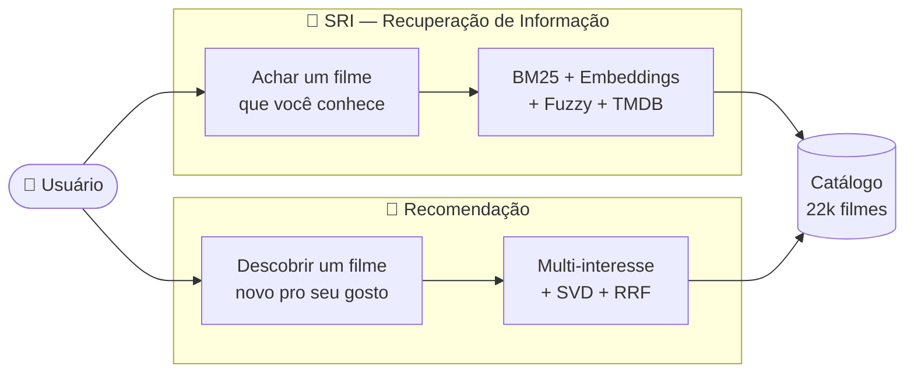
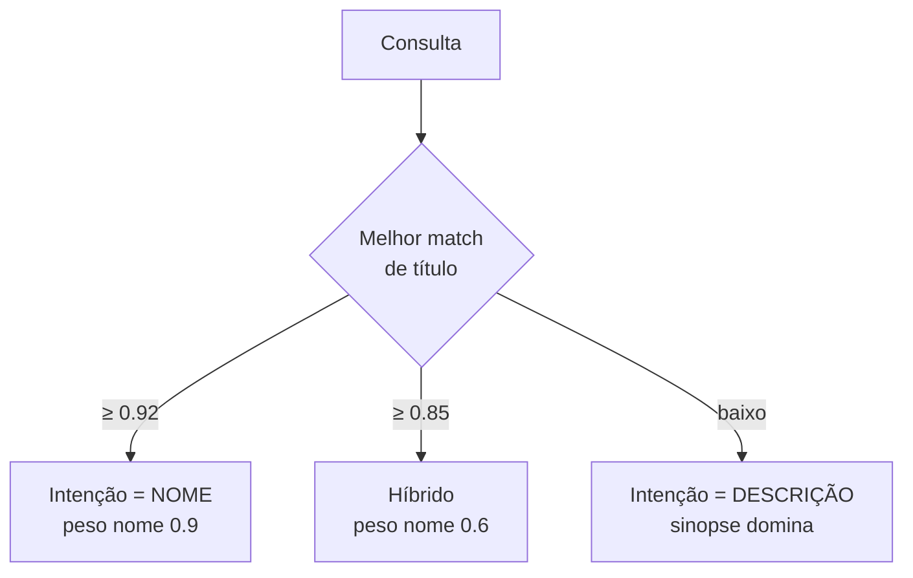
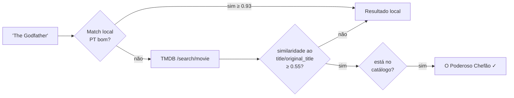
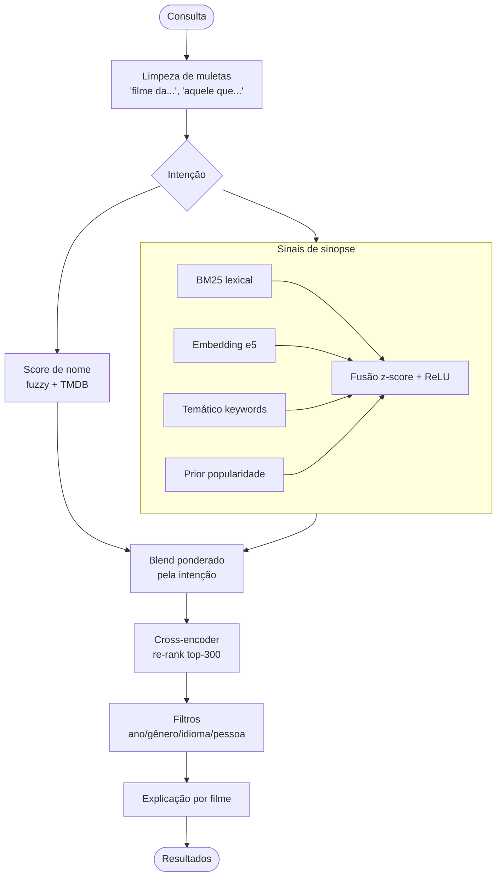
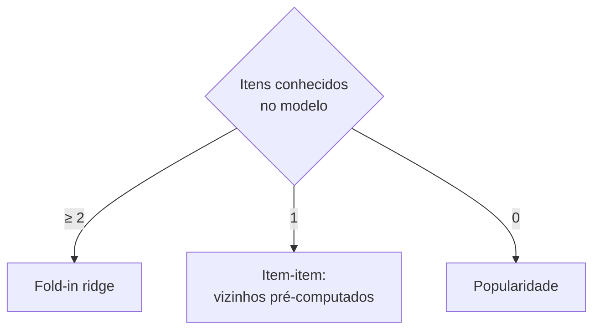
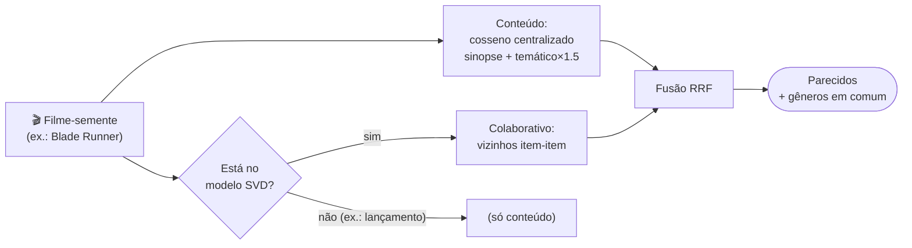

<div align="center">

# 🎬 RecomendAI — Metodologia, Algoritmos e Técnicas

**Como o sistema encontra um filme a partir de uma lembrança vaga e descobre o que você vai gostar de assistir.**


</div>

---

## 🗺️ Índice

- [Visão geral](#-visão-geral)
- [Parte 1 — SRI: encontrar um filme](#-parte-1--sri-encontrar-um-filme)
  - [Técnicas em resumo](#técnicas-em-resumo-sri)
  - [Busca fuzzy por nome](#-busca-fuzzy-por-nome)
  - [BM25 — recuperação lexical](#-bm25--recuperação-lexical)
  - [Embeddings semânticos multilíngues](#-embeddings-semânticos-multilíngues)
  - [Sinal temático (keywords)](#-sinal-temático-keywords)
  - [Fusão de sinais](#-fusão-de-sinais)
  - [Detecção de intenção](#-detecção-de-intenção)
  - [Busca facetada](#-busca-facetada)
  - [Re-ranking com cross-encoder](#-re-ranking-com-cross-encoder)
  - [Busca multilíngue via TMDB](#-busca-multilíngue-via-tmdb)
  - [Explicabilidade](#-explicabilidade)
  - [Pipeline completo](#-pipeline-do-sri)
- [Parte 2 — Recomendação: traçar o perfil](#-parte-2--recomendação-traçar-o-perfil)
  - [Técnicas em resumo](#técnicas-em-resumo-recsys)
  - [Filtragem colaborativa (SVD)](#-filtragem-colaborativa-svd)
  - [Fold-in e fallbacks](#-fold-in-e-fallbacks)
  - [Relevance feedback (Rocchio)](#-relevance-feedback-rocchio)
  - [Perfil multi-interesse](#-perfil-multi-interesse)
  - [Reviews por filme](#-reviews-por-filme)
  - [De-viés de genericidade e MMR](#-de-viés-de-genericidade-e-mmr)
  - [Round-robin ponderado](#-round-robin-ponderado)
  - [Fusão híbrida (RRF)](#-fusão-híbrida-rrf)
  - [Filmes parecidos (item-to-item)](#-filmes-parecidos-item-to-item)
  - [Ingestão do Letterboxd](#-ingestão-do-letterboxd)
  - [Pipeline completo](#-pipeline-da-recomendação)
- [Glossário](#-glossário)
- [Mapa de arquivos](#-mapa-de-arquivos)

---

## 🔭 Visão geral

O RecomendAI tem **dois motores independentes** que resolvem problemas diferentes:



| | 🔎 **SRI** | 🍿 **Recomendação** |
|---|---|---|
| **Pergunta** | "Qual é aquele filme...?" | "O que eu vejo agora?" |
| **Entrada** | texto, diretor, ator, filtros | filmes/notas que você curte |
| **Usa ratings?** | ❌ Não | ✅ Sim |
| **Saída** | filmes que **casam** com a busca | filmes que você vai **gostar** |
| **Núcleo** | BM25 + e5 + cross-encoder | k-means multi-interesse + SVD |

> [!NOTE]
> Os dois motores compartilham o mesmo **índice de embeddings** (`intfloat/multilingual-e5-large`, 1024 dimensões) sobre **22.029 filmes** — construído por [`retrieval/index_builder.py`](../retrieval/index_builder.py).

---

# 🔎 Parte 1 — SRI: encontrar um filme

> **Objetivo:** o usuário lembra *algo* (um trecho da história, um nome aproximado, o diretor) mas não o título exato. O sistema combina vários sinais de evidência para recuperar o filme certo entre 22 mil.

## Técnicas em resumo (SRI)

| Técnica | O que faz | O que resolve | Arquivo |
|---|---|---|---|
| **Busca fuzzy** | casa títulos tolerando erro de digitação e nome parcial | lembrança aproximada do nome | [`search_engine.py`](../retrieval/search_engine.py) |
| **BM25** | ranqueia filmes pelos termos da sinopse | achar pelo enredo, não pelo título | [`bm25.py`](../retrieval/bm25.py) |
| **Embeddings (e5)** | compara o *sentido* do texto, multilíngue | sinônimo, paráfrase, busca em inglês | [`index_builder.py`](../retrieval/index_builder.py) |
| **Sinal temático** | compara tema/atributo via *keywords* | conceitos que não estão na sinopse | [`search_engine.py`](../retrieval/search_engine.py) |
| **Fusão z-score + ReLU** | combina os sinais numa escala comum | juntar evidências sem um sinal dominar | [`search_engine.py`](../retrieval/search_engine.py) |
| **Detecção de intenção** | decide se a consulta é nome ou descrição | uma só caixa serve aos dois usos | [`search_engine.py`](../retrieval/search_engine.py) |
| **Busca facetada** | restringe por diretor/ator/ano/gênero | afunilar com o que se sabe | [`search_engine.py`](../retrieval/search_engine.py) |
| **Cross-encoder** | re-pontua o topo lendo consulta+texto juntos | precisão fina nas primeiras posições | [`reranker.py`](../retrieval/reranker.py) |
| **Fallback TMDB** | resolve título em qualquer idioma | títulos estrangeiros | [`tmdb.py`](../core/tmdb.py) |

---

## 🔤 Busca fuzzy por nome

> **O que faz** — casa a consulta contra os títulos do catálogo usando distância de edição (`rapidfuzz.WRatio`), tolerando erros de digitação, acentuação e nomes parciais.
> **O que resolve** — permite achar o filme mesmo sem digitar o título exato.

A engenharia fina está nas **penalizações de cobertura** em [`_name_score`](../retrieval/search_engine.py), que evitam falsos positivos quando a consulta compartilha só uma palavra com o título.

<details>
<summary><b>📐 Como o score de nome é calculado</b></summary>

Partindo do `WRatio` (0–1):

1. **Normalização de chave** (`_alnum_key`): remove acento, pontuação e o artigo inicial, de modo que `"spider man"`, `"Spider-Man"` e `"Spiderman"` sejam equivalentes.
2. **Cobertura de caracteres** — reduz o score de títulos muito mais curtos que a consulta (evita casar um fragmento).
3. **Cobertura de palavras de conteúdo** — exige que as palavras *não-stopword* da consulta apareçam no título; compartilhar só "uma/homem/com" não conta como casamento.
4. **Bônus de match exato ou de prefixo.**

$$
\text{name\\_score} = \text{WRatio} \cdot \underbrace{(0.4 + 0.6 \cdot \text{cob}_{\text{char}})}_{\text{penaliza fragmento}} \cdot \underbrace{(0.2 + 0.8 \cdot \text{cob}_{\text{palavra}})}_{\text{penaliza palavra vazia}}
$$

</details>

---

## 📚 BM25 — recuperação lexical

> **O que faz** — indexa o texto das sinopses e ranqueia os filmes pela relevância dos **termos** da consulta, com a função **BM25**.
> **O que resolve** — encontrar um filme pelo **enredo descrito**, mesmo quando o usuário não sabe o título.

BM25 é a função de ranking lexical padrão em recuperação de informação. Ela pondera cada termo pelo seu **IDF** (termos raros valem mais), **satura** a frequência (repetir uma palavra rende cada vez menos) e **normaliza pelo tamanho** do documento.

$$
\text{BM25}(D, Q) = \sum_{t \in Q} \text{IDF}(t) \cdot \frac{f(t, D)\,(k_1 + 1)}{f(t, D) + k_1\left(1 - b + b \cdot \frac{|D|}{\text{avgdl}}\right)}
$$

<details>
<summary><b>📐 Parâmetros</b></summary>

- $k_1 = 1.5$ — controla a **saturação** da frequência do termo.
- $b = 0.75$ — intensidade da **normalização por tamanho** do documento.
- Vocabulário: **50.232 termos**, com remoção de *stopwords* em português.
- Pontos fortes: resgata enredos com **termos próprios** ("sete pecados capitais", "revivendo o mesmo dia").

</details>

---

## 🧠 Embeddings semânticos multilíngues

> **O que faz** — converte cada sinopse e cada consulta num **vetor denso de 1024 dimensões** (modelo `multilingual-e5-large`) e mede a proximidade por **similaridade de cosseno**.
> **O que resolve** — casar **sentido**, não apenas palavras: sinônimos e paráfrases ("brinquedos que ganham vida" ↔ *Toy Story*) e busca **entre idiomas**.

Como o modelo é multilíngue, uma frase em português e a sinopse correspondente (ou uma consulta em inglês) caem **próximas no mesmo espaço vetorial**, o que habilita a busca em diferentes idiomas sem tradução.

$$
\cos(\vec{q}, \vec{d}) = \frac{\vec{q} \cdot \vec{d}}{\lVert \vec{q} \rVert \, \lVert \vec{d} \rVert} \;\xrightarrow{\text{L2-norm}}\; \vec{q} \cdot \vec{d}
$$

<details>
<summary><b>📐 Detalhes do modelo</b></summary>

- **Prefixos assimétricos** do e5: a consulta recebe `"query: "` e a sinopse `"passage: "` — necessário para o cosseno ficar bem calibrado.
- Vetores **L2-normalizados**, então o cosseno vira um simples produto escalar (uma multiplicação de matriz $N \times D$).
- Índice construído uma vez (~22 min); cada consulta é resolvida em **milissegundos**.

</details>

---

## 🏷️ Sinal temático (keywords)

> **O que faz** — mantém um **segundo embedding** por filme, construído a partir de **gêneros + keywords** da TMDB, além de um embedding por keyword individual.
> **O que resolve** — recupera por **conceitos e atributos que não aparecem na sinopse** ("time loop", "filme mudo", "preto e branco").

Como a comparação é multilíngue, uma consulta em português como "revivendo o mesmo dia" alcança o tema `time loop` (em inglês) e acende os "chips" de explicação correspondentes no resultado.

---

## ⚖️ Fusão de sinais

> **O que faz** — combina os sinais (BM25, embedding da sinopse, embedding temático) numa **escala comum** via padronização z-score, aplica **ReLU** e soma com pesos.
> **O que resolve** — junta evidências de naturezas diferentes de forma justa, sem que um sinal de escala maior domine os demais.

$$
\text{score}(d) = w_{\text{lex}}\,\text{ReLU}(z_{\text{lex}}) + w_{\text{emb}}\,\text{ReLU}(z_{\text{syn}}) + w_{\text{kw}}\,\text{ReLU}(z_{\text{kw}}) + w_{\text{pop}} \cdot \text{prior}
$$

onde $z(x) = \dfrac{x - \mu}{\sigma}$ padroniza cada sinal.

<details>
<summary><b>🧠 Por que z-score e ReLU</b></summary>

- **z-score** (em vez de min-max): robusto a *outliers* (um filme com score altíssimo não achata os demais) e preserva *quanto* cada sinal separa o filme da média.
- **ReLU($z$)**: cada sinal só **soma** evidência quando está **acima da média**; um filme nunca é penalizado por estar "na média" em algum sinal.
- **Peso lexical adaptativo**: consulta curta valoriza mais o BM25 (~0.30); descrição longa o reduz (~0.20), pois paráfrases usam termos diferentes da sinopse.
- **Prior de popularidade** ($w_{\text{pop}}=0.35$): z-score de $\log(\text{vote\\_count})$, desempata a favor do filme mais conhecido quando muitos casam de forma parecida.

| Sinal | Peso base |
|---|:---:|
| Embedding da sinopse | `0.60` |
| Temático (keywords) | `0.50` |
| Lexical (BM25) | `0.20–0.30` (adaptativo) |
| Prior de popularidade | `0.35` |

</details>

---

## 🎯 Detecção de intenção

> **O que faz** — classifica a consulta como **nome** ou **descrição** e ajusta o peso entre o sinal de título e o de sinopse.
> **O que resolve** — a mesma caixa de busca atende tanto `"Matrix"` (nome) quanto `"hacker descobre que a realidade é simulada"` (descrição).

A intenção é medida pela força do melhor casamento de título no próprio catálogo — uma referência confiável, já que usa exatamente os títulos disponíveis.



O peso-base também varia com o tamanho da consulta: ≤ 3 palavras tende a ser nome; > 5 palavras tende a ser descrição.

---

## 🎬 Busca facetada

> **O que faz** — diretor e ator **restringem** o conjunto (o filme precisa tê-los, via tabela `movie_people`) e a consulta livre **ranqueia** dentro dele; aceita filtros de **ano, gênero e idioma**.
> **O que resolve** — afunilar a busca combinando tudo o que o usuário souber.

Num conjunto já restrito por uma pessoa, o texto quase sempre descreve o enredo, então o sinal de sinopse recebe peso maior do que na busca global.

---

## 🔁 Re-ranking com cross-encoder — *desligado em produção*

> **O que faz** — pegaria os *N* melhores candidatos da primeira etapa e os re-pontuaria com um **cross-encoder**, que lê a consulta e a sinopse **juntas**.
> **Por que fica off** — a avaliação (`python -m eval.run --sweep-rerank`) não achou ganho confiável, e o custo de latência é de ~250×. `RECOMENDAI_RERANK=1` liga para experimentos.

$$
\text{score}_{\text{final}} = \text{blend} \cdot \text{score}_{\text{recuperação}} + (1 - \text{blend}) \cdot \text{score}_{\text{cross-encoder}}, \quad \text{blend}=0.5
$$

<details>
<summary><b>📊 Ablação por sinal (split de teste, 47 consultas <i>held-out</i>)</b></summary>

Medido por `python -m eval.run` (ver [`eval/`](../eval/README.md)). Recuperação *known-item*, e5-large.

| Pipeline | nDCG@10 | MRR | Recall@50 | mediana |
|---|---|---|---|---|
| BM25 puro (lexical) | 0,360 | 0,316 | 0,66 | #7 |
| Só embedding (semântico) | 0,299 | 0,260 | 0,53 | #25 |
| Só temático (keywords) | 0,310 | 0,256 | 0,64 | #10 |
| **Fusão** (produção) | **0,733** | **0,686** | **0,94** | **#1** |

A fusão dispara acima de qualquer sinal isolado (complementares). No split de **calibração** (dev, 95 consultas) a fusão chega a **nDCG@10 0,82 / MRR 0,79** — a diferença dev→teste é o quanto o número "de casa" está otimista.

</details>

<details>
<summary><b>📊 Varredura do cross-encoder — por que fica desligado (split de teste)</b></summary>

| pool | nDCG@10 | MRR | Recall@50 | latência p50 |
|---|---|---|---|---|
| **0 (off)** — produção | 0,733 | 0,686 | 0,94 | **8 ms** |
| 20 | 0,750 | 0,699 | 0,94 | 131 ms |
| 50 | 0,754 | 0,705 | 0,94 | 321 ms |
| 300 (default antigo) | 0,740 | 0,694 | 0,92 | 1 777 ms |

O melhor pool (50) sobe o nDCG@10 em +0,02 no teste, mas **cai** 0,823 → 0,814 no dev — ruído para *n* = 47–95. O pool 300 antigo era o pior: qualidade abaixo do pool 50 *e* Recall@50 menor, a ~1,8 s/busca. Decisão: `RECOMENDAI_RERANK=0` por padrão; se ligar, `RECOMENDAI_RERANK_POOL=50`.

</details>

---

## 🌐 Busca multilíngue via TMDB

> **O que faz** — quando o casamento local (títulos em português) é fraco e a consulta parece um título (≤ 8 palavras), consulta a `/search/movie` da TMDB, valida a similaridade ao `title`/`original_title` retornados e mapeia o resultado para o catálogo.
> **O que resolve** — busca por títulos em **outros idiomas** (ex.: `"The Godfather"` → *O Poderoso Chefão*).



A confiança vem da **similaridade real** ao título devolvido pela TMDB, com a pontuação normalizada (hífen e pontuação não penalizam). Os resultados são **cacheados em disco** e o sistema degrada com elegância quando não há rede.

---

## 🔬 Explicabilidade

> **O que faz** — anexa a cada resultado o **porquê** de ele ter aparecido.
> **O que resolve** — transparência: o usuário vê quais sinais casaram e com qual confiança.

| Componente | O que mostra | Como é calculado |
|---|---|---|
| **Confiança** (0–100) | quão bem o filme casa, em absoluto | logística sobre o z-score do melhor sinal: $\frac{1}{1+e^{-0.85(z-1.4)}}$ |
| **Relevância** (0–100) | posição relativa *nesta* busca | min-max dentro do conjunto retornado |
| **Barra de sinais** | quanto cada sinal pesou | fração da contribuição positiva |
| **Chips de tema** | keywords que casaram | cosseno consulta↔keyword (multilíngue) |

---

## 🧭 Pipeline do SRI



---

# 🍿 Parte 2 — Recomendação: traçar o perfil

> **Objetivo:** a partir do que o usuário ama (filmes escolhidos ou o Letterboxd, **com notas e resenhas**), prever o que ele ainda não viu e vai gostar — inclusive quando o gosto é **multi-modal** (vários estilos distintos ao mesmo tempo).

## Técnicas em resumo (Recsys)

| Técnica | O que faz | O que resolve | Arquivo |
|---|---|---|---|
| **Colaborativo (SVD)** | prevê a nota por fatores latentes de co-avaliação | "quem avalia parecido gostou de X" | [`train.py`](../recommender/train.py) |
| **Fold-in** | encaixa um usuário novo sem retreinar | recomendar para quem acabou de chegar | [`collaborative.py`](../recommender/collaborative.py) |
| **Relevance feedback** | positivos puxam, negativos empurram | usar notas baixas e resenhas ruins | [`profile.py`](../recommender/profile.py) |
| **Multi-interesse** | agrupa o gosto em K vetores | gostos múltiplos sem virar média genérica | [`profile.py`](../recommender/profile.py) |
| **Reviews por filme** | embute a resenha no vetor do filme | aproveitar o que a pessoa articula | [`profile.py`](../recommender/profile.py) |
| **De-viés + MMR** | remove o genérico e diversifica | evitar blockbuster óbvio e repetição | [`profile.py`](../recommender/profile.py) |
| **Round-robin ponderado** | intercala candidatos por interesse | representar todos os gostos | [`profile.py`](../recommender/profile.py) |
| **Fusão híbrida (RRF)** | combina conteúdo + colaborativo | precisão e serendipidade juntas | [`profile.py`](../recommender/profile.py) |
| **Parecidos (item-item)** | acha similares a um filme-semente | "gostei de X, quero mais como X" | [`similar.py`](../recommender/similar.py) |

---

## 🤝 Filtragem colaborativa (SVD)

> **O que faz** — fatora a matriz **usuário × item** de notas reais em **fatores latentes** (estilo *Funk-SVD*) e prevê a nota que um usuário daria a um filme.
> **O que resolve** — capta padrões de co-avaliação: "pessoas com gosto parecido com o seu gostaram de X", mesmo sem analisar o conteúdo do filme.

$$
\hat{r}_{ui} = \mu + b_i + \vec{q}_i \cdot \vec{p}_u
$$

onde $\mu$ = média global, $b_i$ = viés do item, $\vec{q}_i$ = fatores do item, $\vec{p}_u$ = fatores do usuário.

<details>
<summary><b>📊 O modelo treinado (dados reais)</b></summary>

| Métrica | Valor |
|---|---|
| Avaliações | **2.911.675** |
| Usuários | **19.835** |
| Filmes | **15.246** |
| Fatores latentes ($k$) | 50 |
| Épocas | 20 |
| **RMSE** (holdout) | **0.799** |
| **MAE** (holdout) | **0.606** |
| Escala | 0.5 – 5.0 |

Treinado por [`recommender/train.py`](../recommender/train.py); os fatores ($q_i$, $b_i$, $\mu$) ficam serializados em `.npy` para inferência em milissegundos.

</details>

---

## 🧩 Fold-in e fallbacks

> **O que faz** — para um usuário **novo** (que não estava no treino), resolve o vetor latente $\vec{p}$ por **regressão ridge** sobre os itens que ele já avaliou, sem retreinar o modelo.
> **O que resolve** — recomendar para quem acabou de importar o Letterboxd ou escolher filmes agora.

$$
\vec{p} = \arg\min_{\vec{p}} \lVert \vec{y} - Q\vec{p} \rVert^2 + \lambda \lVert \vec{p} \rVert^2 \;\Rightarrow\; \vec{p} = (Q^\top Q + \lambda I)^{-1} Q^\top \vec{y}, \quad \vec{y} = r - \mu - b_i
$$

<details>
<summary><b>🧠 Cascata de estratégias e ajuste do viés</b></summary>



- **Ajuste do viés** ($b_i$): no ranking usa-se $\mu + 0.5\,b_i + \vec{q}_i\cdot\vec{p}$. Reduzir o peso do viés de item privilegia o **casamento de gosto** ($\vec{q}_i\cdot\vec{p}$) em vez de empurrar clássicos universais para qualquer perfil.
- **Item-item**: com poucos itens conhecidos, agrega os vizinhos mais próximos pré-computados.
- **Popularidade**: fallback quando nada se sabe do usuário.

</details>

---

## ➕➖ Relevance feedback (Rocchio)

> **O que faz** — o perfil é **puxado** pelos filmes bem avaliados e **empurrado** pelos mal avaliados; o peso é graduado pela nota.
> **O que resolve** — aproveita o sinal **negativo** (notas baixas e resenhas ruins), e não só o que a pessoa gostou.

$$
\vec{perfil} = \alpha \cdot \text{centroide}(\text{amados}) - \beta \cdot \text{centroide}(\text{detestados})
$$

Pesos graduados pela nota (escala Letterboxd 0.5–5.0):

$$
w^{+}(r) = r - 2.5 \quad (5\star \to 2.5,\; 4\star \to 1.5) \qquad w^{-}(r) = 3.0 - r \quad (0.5\star \to 2.5)
$$

Na prática, antipatias por um estilo afastam as recomendações daquele estilo, refinando o perfil para além do que os "amados" sozinhos indicariam.

---

## 🎭 Perfil multi-interesse

> **O que faz** — agrupa os filmes amados em **K interesses** com **k-means esférico** e pontua cada candidato pelo **melhor** interesse (*max-pooling*).
> **O que resolve** — representa gostos **múltiplos e distintos** (ex.: ficção científica, romance e terror) sem fundi-los numa média.

Um único vetor médio de gostos diferentes aponta para o **centro** do espaço de embeddings — onde estão os filmes mais genéricos. O perfil multi-interesse evita isso ao manter um vetor por gosto e deixar cada candidato casar com o seu interesse mais próximo.


$$
K = \text{clip}\!\left(\text{round}(n_{\text{amados}}/4),\; 1,\; 5\right) \qquad \text{score}(c) = \max_{k}\; z\big(\vec{c}\cdot\vec{I}_k^{\text{syn}} + w_{\text{kw}}\,\vec{c}\cdot\vec{I}_k^{\text{kw}}\big) - \text{penalidades}
$$

Cada interesse é padronizado **separadamente**, de modo que um gosto de **nicho** compete em pé de igualdade com um gosto popular. É a abordagem das técnicas de *multi-interest recommendation* (MIND, ComiRec), aqui em uma versão tratável por usuário.

---

## ✍️ Reviews por filme

> **O que faz** — embute o texto de cada resenha e o mistura ao vetor **daquele** filme específico.
> **O que resolve** — incorpora **o que a pessoa articula** (tom, temas que destacou) ao definir o gosto, em vez de tratar todas as resenhas como um bloco único.

$$
\vec{v}_i = \text{norm}\big((1 - \rho)\,\vec{v}_i^{\,\text{sinopse}} + \rho\,\vec{v}_i^{\,\text{review}}\big), \quad \rho = 0.30
$$

---

## 🧹 De-viés de genericidade e MMR

> **O que faz** — subtrai do score a semelhança do candidato com a **direção média** do catálogo (genericidade) e reordena o topo com **MMR** para diversificar.
> **O que resolve** — evita recomendar o blockbuster óbvio que "parece com todo filme" e impede listas repetitivas (várias sequências do mesmo título).

$$
\text{MMR}(c) = \lambda \cdot \text{rel}(c) - (1 - \lambda)\,\max_{s \in S}\, \text{sim}(c, s), \quad \lambda = 0.72
$$

O termo de genericidade trata a chamada *hubness* — a tendência de itens centrais aparecerem para todos os perfis.

---

## 🔄 Round-robin ponderado

> **O que faz** — cada interesse recupera os **seus próprios** candidatos, que são intercalados num round-robin proporcional ao peso do interesse.
> **O que resolve** — garante que **todos os gostos** apareçam na recomendação, na proporção certa, sem o gosto mais coeso abafar os demais.

Por exemplo, um perfil com mais filmes de ficção científica do que de romance recebe recomendações nessa mesma proporção. É a forma como modelos multi-interesse agregam, em *serving*, as K listas (uma por interesse).

---

## 🔗 Fusão híbrida (RRF)

> **O que faz** — funde o ranking de **conteúdo** (multi-interesse) com o de **colaborativo** (SVD) por **Reciprocal Rank Fusion**, que combina pela **posição**, não pelo score cru.
> **O que resolve** — une a precisão do conteúdo com a **serendipidade** da co-avaliação real, sem depender de escalas comparáveis entre os dois sinais.

$$
\text{score}(d) = \sum_{r \in \{\text{conteúdo, colab}\}} \frac{w_r}{k + \text{rank}_r(d)}, \quad k = 20,\; w_{\text{cont}}=1.0,\; w_{\text{colab}}=0.5
$$

---

## 🎯 Filmes parecidos (item-to-item)

> **O que faz** — a partir de **um** filme-semente, recupera os mais parecidos fundindo dois sinais: **similaridade de conteúdo** (embeddings e5) e **vizinhos colaborativos** item-item do SVD.
> **O que resolve** — "gostei de *Blade Runner*, me dá parecidos que talvez eu goste" — recomendação imediata, sem precisar traçar um perfil inteiro a partir de vários filmes.

Diferente do perfil (que parte de *vários* filmes com notas), aqui a semente é **um** título. Os dois motores que o projeto já tem entram em jogo:

| Sinal | O que captura | De onde vem |
|---|---|---|
| **Conteúdo (e5)** | "tem a mesma cara/tema" (replicante, dystopia, neo-noir) | índice de embeddings (sinopse + temático) |
| **Colaborativo (item-item)** | "quem gostou deste também gostou" | vizinhos pré-computados do SVD |

### Cosseno centralizado (de-viés de hubness)

A similaridade de conteúdo crua sofre de **hubness**: blockbusters de ação que "parecem com todo filme" ficam no centro do espaço de embeddings e invadem qualquer lista de parecidos (ex.: *Velozes & Furiosos* surgindo como similar a *Blade Runner*). Para corrigir, comparamos no espaço **centralizado** — subtraindo a direção média do catálogo $\mu$ antes do cosseno:

$$
\text{sim}(a, i) = \frac{(\vec{m}_a - \mu)\cdot(\vec{m}_i - \mu)}{\lVert \vec{m}_a - \mu\rVert\,\lVert \vec{m}_i - \mu\rVert}
$$

Remover $\mu$ tira o componente comum (o "hub") de forma **simétrica**, deixando só o que **distingue** os filmes. É o de-viés de genericidade do perfil, na sua forma mais limpa. O score de conteúdo soma os dois embeddings, com o **temático pesando mais** que no perfil:

$$
\text{score}_{\text{cont}}(i) = \text{sim}_{\text{sinopse}}(a, i) + w_{\text{kw}} \cdot \text{sim}_{\text{temático}}(a, i), \quad w_{\text{kw}} = 1.5
$$

<details>
<summary><b>🧠 Por que o temático pesa mais aqui (1.5 vs. 0.5 no perfil)</b></summary>

O que define "mesmo **tipo** de filme" é o **tema/gênero** (dystopia, IA, android), não o vocabulário de ação da sinopse — duas sinopses cheias de "agente", "perseguição" e "explosão" ficam próximas mesmo sendo filmes muito diferentes. Subir o peso temático afasta a ação genérica e aproxima os parecidos de verdade (validado em sci-fi, romance, terror, máfia e franquias).

**Forma fechada:** o cosseno centralizado é calculado **sem** materializar uma cópia centralizada da matriz $N\times D$ — usando $\lVert \vec{m}_i - \mu\rVert = \sqrt{1 - 2(\vec{m}_i\cdot\mu) + \mu\cdot\mu}$ (válido porque $\vec{m}_i$ é L2-normalizado). Isso economiza ~180 MB de RAM no servidor.

</details>

### Fusão e degradação graciosa

Os rankings de conteúdo e colaborativo são fundidos por **RRF** (igual ao perfil), com o conteúdo mandando:

$$
\text{score}(d) = \frac{w_{\text{cont}}}{k + \text{rank}_{\text{cont}}(d)} + \frac{w_{\text{colab}}}{k + \text{rank}_{\text{colab}}(d)}, \quad k=20,\; w_{\text{cont}}=1.0,\; w_{\text{colab}}=0.6
$$



Um **lançamento recente** ainda não tem sinal colaborativo (não estava no treino do SVD) — nesse caso a lista usa **só conteúdo**, sem quebrar. O mesmo vale ao contrário: filme fora do índice de conteúdo cai no colaborativo. Exposto pela rota `GET /similar/<tmdb_id>`.

---

## 📥 Ingestão do Letterboxd

> **O que faz** — lê o `ratings.csv` exportado do Letterboxd, resolve cada filme para o `tmdb_id` e monta a entrada do perfil.
> **O que resolve** — transforma o histórico real do usuário (notas e resenhas) em sinal para o motor de recomendação.


A escala de nota do Letterboxd (0.5–5.0) é a mesma do modelo — sem reescalar. A resenha, quando presente, alimenta a técnica de [reviews por filme](#-reviews-por-filme).

---

## 🧭 Pipeline da recomendação


---

## 📚 Glossário

| Termo | Significado |
|---|---|
| **SRI** | Sistema de Recuperação de Informação (encontrar, não recomendar) |
| **BM25** | Função de ranking lexical; TF-IDF saturado e normalizado por tamanho |
| **Embedding** | Vetor denso que representa o *sentido* de um texto |
| **Cosseno** | Medida de similaridade entre vetores (ângulo) |
| **z-score** | Padronização $(x-\mu)/\sigma$ para comparar escalas diferentes |
| **ReLU** | $\max(0, x)$ — aqui, "só soma evidência positiva" |
| **SVD** | Fatoração da matriz de notas em fatores latentes |
| **Fold-in** | Encaixar um usuário novo sem retreinar o modelo |
| **Rocchio** | Relevance feedback: positivos puxam, negativos empurram |
| **Multi-interesse** | Representar o gosto por vários vetores, não um |
| **MMR** | Re-ranking que equilibra relevância e diversidade |
| **RRF** | Fusão de rankings por posição recíproca |
| **Cross-encoder** | Modelo que lê consulta e documento juntos (preciso, mais lento) |
| **Hubness** | Tendência de itens "centrais" aparecerem para todos os perfis |

---

## 🗂️ Mapa de arquivos

```
RecomendaAI/
├── retrieval/                    🔎 SRI
│   ├── search_engine.py          fusão, intenção, facetas, fallback TMDB, explicação
│   ├── bm25.py                   sinal lexical (BM25)
│   ├── index_builder.py          constrói embeddings (e5) + índice BM25
│   ├── reranker.py               cross-encoder (2ª etapa)
│   └── query_expander.py         tradução PT→EN opcional p/ keywords
├── recommender/                  🍿 Recomendação
│   ├── profile.py                multi-interesse, Rocchio, reviews, MMR, RRF
│   ├── similar.py                filmes parecidos (item-to-item): cosseno centralizado + colaborativo
│   ├── collaborative.py          SVD fold-in, item-item, fallbacks
│   ├── train.py                  treina o SVD nos ratings reais
│   └── letterboxd.py             ingestão do ratings.csv
├── core/
│   ├── catalog.py                catálogo (SQLite/JSON)
│   ├── tmdb.py                   cliente TMDB (busca + pôsteres, cacheado)
│   └── posters.py                anexa pôsteres aos resultados
└── docs/METODOLOGIA.md           📄 este documento
```

<div align="center">

---

**RecomendAI** — dois motores, uma experiência. 🎬

</div>
